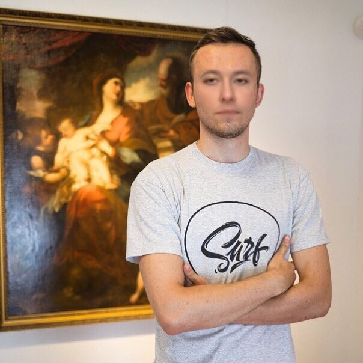
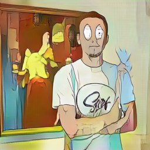
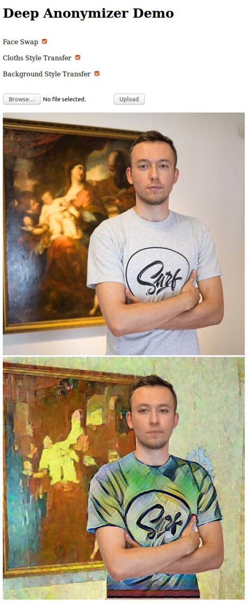

# Item swap
This is part of source code for picsart.ai hackaton. It consist of two part: swapping face and swapping 
background. Full repo: https://github.com/n01z3/deep-anonymizer 

## Examples
Source image:


Face swap:



Background swap:



All together:



## Using
### For initialization:
```
- git clone https://github.com/EvgenyKashin/ItemSwap.git
- make docker-build
- make load-weights
```

### For training:
```
- make train-face
- TODO: write instruction
```

### For face and background swap:
```
- make convert-face-video
- make convert-face-image
- make convert-background-image
```
For parameters see Makefile

***Important:*** there is ```loadSize``` parameter in ```make convert-background-image``` for changing image size.

## Links
### About hackathon
https://habr.com/company/ods/blog/433586/ - article (rus)
### Based on
- https://github.com/shaoanlu/faceswap-GAN
- https://github.com/junyanz/pytorch-CycleGAN-and-pix2pix
